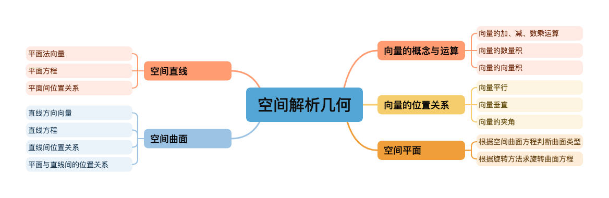

# 知识空间及逻辑

---

## 📘 考点一：向量的表示与计算

### 一、向量的定义

**向量（Vector）** 是既有**大小（模）**又有**方向**的量。

* 表示方法：常用 **→AB** 或 **a⃗** 来表示一个向量。
* 向量的大小称为 **模**，记作：
  [
  |\vec{a}|
  ]
* 向量的方向由它的起点和终点确定。

---

### 二、向量的表示方法

1. **几何表示法**

   * 向量可以表示为一条有向线段，从起点指向终点。
   * 若点 A 的坐标为 ((x_1, y_1))，点 B 的坐标为 ((x_2, y_2))，则：
     [
     \overrightarrow{AB} = (x_2 - x_1,, y_2 - y_1)
     ]

2. **坐标表示法**

   * 在平面直角坐标系中，向量 (\vec{a}) 可以表示为：
     [
     \vec{a} = (x, y)
     ]
   * 在空间直角坐标系中：
     [
     \vec{a} = (x, y, z)
     ]

3. **单位向量**

   * 模为 1 的向量称为单位向量。
   * 单位向量常用：
     [
     \hat{i},\ \hat{j},\ \hat{k}
     ]
     分别表示 x、y、z 方向的单位向量。
   * 若 (\vec{a}) ≠ 0，则其单位向量为：
     [
     \hat{a} = \frac{\vec{a}}{|\vec{a}|}
     ]

---

### 三、向量的基本运算

#### 1. 向量的加法

[
\vec{a} + \vec{b} = (x_1 + x_2,, y_1 + y_2)
]
**几何意义**：平行四边形法则。

#### 2. 向量的减法

[
\vec{a} - \vec{b} = (x_1 - x_2,, y_1 - y_2)
]
**几何意义**：表示从 (\vec{b}) 到 (\vec{a}) 的向量。

#### 3. 向量的数乘（标量乘）

[
k\vec{a} = (kx,, ky)
]

* 当 (k > 0)：方向相同；
* 当 (k < 0)：方向相反；
* 当 (|k|) 表示放大或缩小的倍数。

---

### 四、向量的数量积（点积）

[
\vec{a} \cdot \vec{b} = |\vec{a}|,|\vec{b}|,\cos\theta
]

或在坐标形式下：
[
\vec{a} \cdot \vec{b} = x_1x_2 + y_1y_2
]

**性质与应用：**

* 若 (\vec{a} \cdot \vec{b} = 0)，则 (\vec{a} \perp \vec{b})
* 可用于计算夹角：
  [
  \cos\theta = \frac{\vec{a} \cdot \vec{b}}{|\vec{a}|,|\vec{b}|}
  ]
* 向量投影：
  [
  \text{proj}_{\vec{b}}(\vec{a}) = \frac{\vec{a}\cdot\vec{b}}{|\vec{b}|}
  ]

---

### 五、向量的向量积（叉积）

（仅在三维空间定义）

[
\vec{a} \times \vec{b} =
\begin{vmatrix}
\hat{i} & \hat{j} & \hat{k} \
x_1 & y_1 & z_1 \
x_2 & y_2 & z_2
\end{vmatrix}
= (y_1z_2 - z_1y_2,, z_1x_2 - x_1z_2,, x_1y_2 - y_1x_2)
]

**性质与意义：**

* (|\vec{a} \times \vec{b}| = |\vec{a}|,|\vec{b}|,\sin\theta)
* 表示以 (\vec{a}, \vec{b}) 为邻边的平行四边形面积；
* 结果方向由**右手法则**确定。

---

### 六、向量的混合积（Triple Product）

[
\vec{a} \cdot (\vec{b} \times \vec{c})
]
几何意义：表示由 (\vec{a}, \vec{b}, \vec{c}) 构成的平行六面体体积。

---

### 七、常用公式总结

|  运算  |                  表达式                 |   几何意义   |   |         |             |         |
| :--: | :----------------------------------: | :------: | - | ------- | ----------- | ------- |
| 向量加法 |          (\vec{a} + \vec{b})         |  平行四边形法则 |   |         |             |         |
| 向量减法 |          (\vec{a} - \vec{b})         | 从 b 指向 a |   |         |             |         |
|  数乘  |              (k\vec{a})              |  改变大小和方向 |   |         |             |         |
|  点积  |        (\vec{a}\cdot\vec{b} =        |  \vec{a} |   | \vec{b} | \cos\theta) | 计算夹角、投影 |
|  叉积  |        (\vec{a}\times\vec{b})        |  求面积、方向  |   |         |             |         |
|  混合积 | (\vec{a}\cdot(\vec{b}\times\vec{c})) |    求体积   |   |         |             |         |

---

