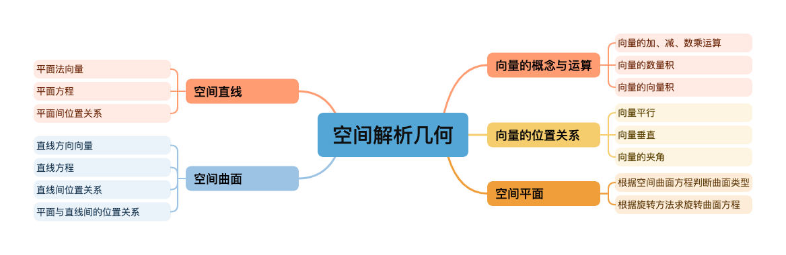
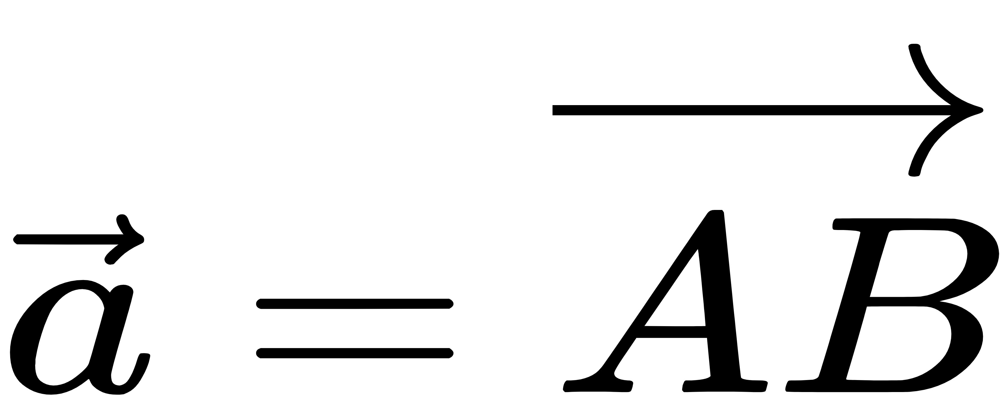
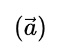
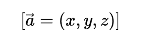

# 知识空间及逻辑

---


---

## 向量的表示与计算（空间解析几何）

> 本文总结了三维空间中向量的基本概念、代数表示方法以及常见运算规则，帮助理解空间解析几何中的核心工具。

---

## 一、向量的基本概念

<div style="background-color:#99ccff; padding:10px; border-left:4px solid #1E90FF; color:#003366;">
<b>向量（Vector）</b> 是一个既有 <b>大小</b> 又有 <b>方向</b> 的量。<br>
例如速度、力、位移等都可以用向量来表示。
</div>


```
我们通常用带箭头的符号表示向量：



其中 \( A \) 是起点，\( B \) 是终点。

如果只关心大小而不关心方向，我们称为**标量（Scalar）**，如温度、质量、时间等。
```

---

## 二、向量的代数表示

### 1. 向量的坐标表示

在三维直角坐标系中，若向量  的起点为 \(O(0,0,0)\)，终点为 \(A(x, y, z)\)，  
则该向量可表示为：



即：
\[
\vec{a} = x\vec{i} + y\vec{j} + z\vec{k}
\]
其中：
- \(\vec{i}\)：x 轴正方向的单位向量  
- \(\vec{j}\)：y 轴正方向的单位向量  
- \(\vec{k}\)：z 轴正方向的单位向量  


### 2. 向量的模（长度）

向量的模（或长度）定义为：
\[
|\vec{a}| = \sqrt{x^2 + y^2 + z^2}
\]

---

## 三、向量的线性运算

### 1. 向量的加法

若 \(\vec{a} = (x_1, y_1, z_1)\)，\(\vec{b} = (x_2, y_2, z_2)\)，  
则：
\[
\vec{a} + \vec{b} = (x_1 + x_2, \, y_1 + y_2, \, z_1 + z_2)
\]

> **几何意义**：首尾相接法或平行四边形法则。

### 2. 向量的减法

\[
\vec{a} - \vec{b} = (x_1 - x_2, \, y_1 - y_2, \, z_1 - z_2)
\]

### 3. 向量与数的乘法

若 \(k\) 为实数，则：
\[
k\vec{a} = (kx, ky, kz)
\]
当 \(k > 0\) 时方向不变，\(k < 0\) 时方向相反。

---

## 四、向量的数量积（点积）

### 1. 定义

两个向量 \(\vec{a}\) 与 \(\vec{b}\) 的**数量积**定义为：
\[
\vec{a} \cdot \vec{b} = |\vec{a}| \, |\vec{b}| \cos\theta
\]
其中 \(\theta\) 为两向量之间的夹角。

### 2. 坐标形式

\[
\vec{a} \cdot \vec{b} = x_1x_2 + y_1y_2 + z_1z_2
\]

### 3. 应用

- 判断垂直：  
  \(\vec{a} \cdot \vec{b} = 0 \Rightarrow \vec{a} \perp \vec{b}\)

- 求夹角：  
  \[
  \cos\theta = \frac{\vec{a} \cdot \vec{b}}{|\vec{a}||\vec{b}|}
  \]

---

## 五、向量的叉积（向量积）

### 1. 定义

\[
\vec{a} \times \vec{b} = |\vec{a}| \, |\vec{b}| \sin\theta \, \vec{n}
\]
其中：
- \(\vec{n}\) 为垂直于 \(\vec{a}\) 与 \(\vec{b}\) 的单位向量
- 方向遵守**右手法则**

### 2. 坐标表示

\[
\vec{a} \times \vec{b} =
\begin{vmatrix}
\vec{i} & \vec{j} & \vec{k} \\
x_1 & y_1 & z_1 \\
x_2 & y_2 & z_2
\end{vmatrix}
= (y_1z_2 - z_1y_2)\vec{i} - (x_1z_2 - z_1x_2)\vec{j} + (x_1y_2 - y_1x_2)\vec{k}
\]

### 3. 应用

- 求平行四边形面积：  
  \(|\vec{a} \times \vec{b}|\)

- 判断平行：  
  \(\vec{a} \times \vec{b} = \vec{0} \Rightarrow \vec{a} \parallel \vec{b}\)

---

## 六、混合积（Triple Product）

三个向量 \(\vec{a}, \vec{b}, \vec{c}\) 的**混合积**定义为：
\[
[\vec{a}, \vec{b}, \vec{c}] = \vec{a} \cdot (\vec{b} \times \vec{c})
\]

### 几何意义：
- 其绝对值等于由三个向量构成的**平行六面体的体积**：
  \[
  V = |[\vec{a}, \vec{b}, \vec{c}]|
  \]

### 行列式表示：
\[
[\vec{a}, \vec{b}, \vec{c}] =
\begin{vmatrix}
x_1 & y_1 & z_1 \\
x_2 & y_2 & z_2 \\
x_3 & y_3 & z_3
\end{vmatrix}
\]

---

## 七、应用举例

### 例1：求两条直线的夹角

设两条直线的方向向量为：
\[
\vec{a} = (1, 2, 3), \quad \vec{b} = (2, -1, 1)
\]

则：
\[
\cos\theta = \frac{\vec{a} \cdot \vec{b}}{|\vec{a}||\vec{b}|}
= \frac{1 \times 2 + 2 \times (-1) + 3 \times 1}{\sqrt{1^2+2^2+3^2} \sqrt{2^2+(-1)^2+1^2}}
= \frac{3}{\sqrt{14}\sqrt{6}}
\]

### 例2：求三点 \(A(1,0,0)\)、\(B(0,1,0)\)、\(C(0,0,1)\) 所构成的三角形面积

\[
S = \frac{1}{2} |\overrightarrow{AB} \times \overrightarrow{AC}|
\]

计算：
\[
\overrightarrow{AB} = (-1, 1, 0), \quad \overrightarrow{AC} = (-1, 0, 1)
\]
\[
\overrightarrow{AB} \times \overrightarrow{AC} = 
\begin{vmatrix}
\vec{i} & \vec{j} & \vec{k} \\
-1 & 1 & 0 \\
-1 & 0 & 1
\end{vmatrix}
= (1, 1, 1)
\]
\[
S = \frac{1}{2} \sqrt{1^2 + 1^2 + 1^2} = \frac{\sqrt{3}}{2}
\]

---

## 八、总结

| 运算类型 | 结果类型 | 几何意义 | 常用符号 |
|-----------|------------|------------|------------|
| 向量加减 | 向量 | 平移或合力 | \(\vec{a}+\vec{b}\) |
| 数量积 | 标量 | 投影、夹角 | \(\vec{a}\cdot\vec{b}\) |
| 向量积 | 向量 | 面积、垂直方向 | \(\vec{a}\times\vec{b}\) |
| 混合积 | 标量 | 体积 | \([\vec{a},\vec{b},\vec{c}]\) |

---

> 💡 **学习建议：**  
> 熟练掌握三维向量的代数运算是理解空间解析几何的关键。  
> 建议在学习时结合几何直观（如图形推理）与代数运算（如行列式计算）双线思考。

---

📘 **参考资料**  
- 《高等数学·空间解析几何》  
- 《线性代数及几何基础》  
- 《Calculus and Analytic Geometry》 – George B. Thomas  
- 《Cours de Mathématiques Générales》 – Jean-Marie Monier  

