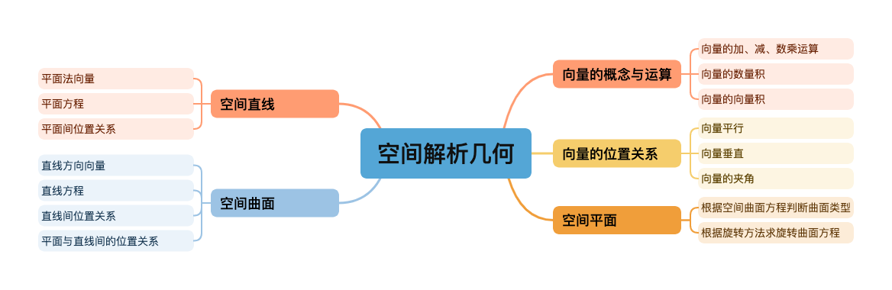
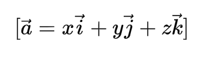
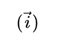
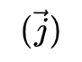
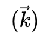
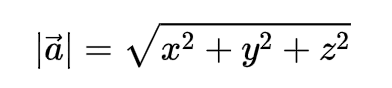
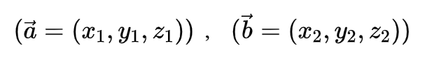
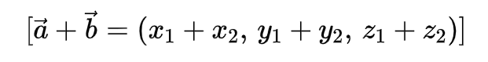

# 知识空间及逻辑

---


---

## 向量的表示与计算（空间解析几何）

> 本文总结了三维空间中向量的基本概念、代数表示方法以及常见运算规则，帮助理解空间解析几何中的核心工具。

---

## 一、向量的基本概念

<div style="background-color:#99ccff; padding:10px; border-left:4px solid #1E90FF; color:#003366;">
<b>向量（Vector）</b> 是一个既有 <b>大小</b> 又有 <b>方向</b> 的量。<br>
例如速度、力、位移等都可以用向量来表示。
</div>

---

```
我们通常用带箭头的符号表示向量：
```


```
其中 \( A \) 是起点，\( B \) 是终点。

如果只关心大小而不关心方向，我们称为**标量（Scalar）**，如温度、质量、时间等。
```

---

## 二、向量的代数表示

### 1. 向量的坐标表示

在三维直角坐标系中，若向量  的起点为 \( O (0,0,0)\)，终点为 \( A (x, y, z)\)，  
则该向量可表示为：


即：



其中：
- ：x 轴正方向的单位向量  
- ：y 轴正方向的单位向量  
- ：z 轴正方向的单位向量  


### 2. 向量的模（长度）

向量的模（或长度）定义为：



---

## 三、向量的线性运算

### 1. 向量的加法

若  ，  
则：
 ，  

> **几何意义**：首尾相接法或平行四边形法则。

### 2. 向量的减法

<math xmlns="http://www.w3.org/1998/Math/MathML" display="block"><mo stretchy="false">[</mo><mrow><mover><mi>a</mi><mo stretchy="false">→</mo></mover></mrow><mo>−</mo><mrow><mover><mi>b</mi><mo stretchy="false">→</mo></mover></mrow><mo>=</mo><mo stretchy="false">(</mo><msub><mi>x</mi><mn>1</mn></msub><mo>−</mo><msub><mi>x</mi><mn>2</mn></msub><mo>,</mo><mstyle scriptlevel="0"><mspace width="thinmathspace"></mspace></mstyle><msub><mi>y</mi><mn>1</mn></msub><mo>−</mo><msub><mi>y</mi><mn>2</mn></msub><mo>,</mo><mstyle scriptlevel="0"><mspace width="thinmathspace"></mspace></mstyle><msub><mi>z</mi><mn>1</mn></msub><mo>−</mo><msub><mi>z</mi><mn>2</mn></msub><mo stretchy="false">)</mo><mo stretchy="false">]</mo></math>

### 3. 向量与数的乘法

若K 为实数，则：
<math xmlns="http://www.w3.org/1998/Math/MathML" display="block"><mo stretchy="false">[</mo><mi>k</mi><mrow><mover><mi>a</mi><mo stretchy="false">→</mo></mover></mrow><mo>=</mo><mo stretchy="false">(</mo><mi>k</mi><mi>x</mi><mo>,</mo><mi>k</mi><mi>y</mi><mo>,</mo><mi>k</mi><mi>z</mi><mo stretchy="false">)</mo><mo stretchy="false">]</mo></math>
当 \(k > 0\) 时方向不变，\(k < 0\) 时方向相反。

---

## 四、向量的数量积（点积）

### 1. 定义
两个向量 
<math xmlns="http://www.w3.org/1998/Math/MathML" display="inline">
  <mover><mi>a</mi><mo>→</mo></mover>
</math> 与 
<math xmlns="http://www.w3.org/1998/Math/MathML" display="inline">
  <mover><mi>b</mi><mo>→</mo></mover>
</math> 的 <b>数量积</b> 定义为：
<math xmlns="http://www.w3.org/1998/Math/MathML" display="inline">
  <mi>a</mi><mo>⋅</mo><mi>b</mi>
</math>:
<math xmlns="http://www.w3.org/1998/Math/MathML" display="block"><mo stretchy="false">[</mo><mrow><mover><mi>a</mi><mo stretchy="false">→</mo></mover></mrow><mo>⋅</mo><mrow><mover><mi>b</mi><mo stretchy="false">→</mo></mover></mrow><mo>=</mo><mrow><mo stretchy="false">|</mo></mrow><mrow><mover><mi>a</mi><mo stretchy="false">→</mo></mover></mrow><mrow><mo stretchy="false">|</mo></mrow><mstyle scriptlevel="0"><mspace width="thinmathspace"></mspace></mstyle><mrow><mo stretchy="false">|</mo></mrow><mrow><mover><mi>b</mi><mo stretchy="false">→</mo></mover></mrow><mrow><mo stretchy="false">|</mo></mrow><mi>cos</mi><mo data-mjx-texclass="NONE">⁡</mo><mi>θ</mi><mo stretchy="false">]</mo></math>
其中 \(\theta\) 为两向量之间的夹角。

### 2. 坐标形式

<math xmlns="http://www.w3.org/1998/Math/MathML" display="block"><mo stretchy="false">[</mo><mrow><mover><mi>a</mi><mo stretchy="false">→</mo></mover></mrow><mo>⋅</mo><mrow><mover><mi>b</mi><mo stretchy="false">→</mo></mover></mrow><mo>=</mo><msub><mi>x</mi><mn>1</mn></msub><msub><mi>x</mi><mn>2</mn></msub><mo>+</mo><msub><mi>y</mi><mn>1</mn></msub><msub><mi>y</mi><mn>2</mn></msub><mo>+</mo><msub><mi>z</mi><mn>1</mn></msub><msub><mi>z</mi><mn>2</mn></msub><mo stretchy="false">]</mo></math>

### 3. 应用

- 判断垂直：  
  <math xmlns="http://www.w3.org/1998/Math/MathML" display="block"><mo stretchy="false">(</mo><mrow><mover><mi>a</mi><mo stretchy="false">→</mo></mover></mrow><mo>⋅</mo><mrow><mover><mi>b</mi><mo stretchy="false">→</mo></mover></mrow><mo>=</mo><mn>0</mn><mo stretchy="false">⇒</mo><mrow><mover><mi>a</mi><mo stretchy="false">→</mo></mover></mrow><mo>⊥</mo><mrow><mover><mi>b</mi><mo stretchy="false">→</mo></mover></mrow><mo stretchy="false">)</mo></math>

- 求夹角：  
  <math xmlns="http://www.w3.org/1998/Math/MathML" display="block"><mo stretchy="false">[</mo><mi>cos</mi><mo data-mjx-texclass="NONE">⁡</mo><mi>θ</mi><mo>=</mo><mfrac><mrow><mrow><mover><mi>a</mi><mo stretchy="false">→</mo></mover></mrow><mo>⋅</mo><mrow><mover><mi>b</mi><mo stretchy="false">→</mo></mover></mrow></mrow><mrow><mo stretchy="false">|</mo><mrow><mover><mi>a</mi><mo stretchy="false">→</mo></mover></mrow><mrow><mo stretchy="false">|</mo></mrow><mrow><mo stretchy="false">|</mo></mrow><mrow><mover><mi>b</mi><mo stretchy="false">→</mo></mover></mrow><mo stretchy="false">|</mo></mrow></mfrac><mo stretchy="false">]</mo></math>

---

## 五、向量的叉积（向量积）

### 1. 定义

<math xmlns="http://www.w3.org/1998/Math/MathML" display="block"><mo stretchy="false">[</mo><mrow><mover><mi>a</mi><mo stretchy="false">→</mo></mover></mrow><mo>×</mo><mrow><mover><mi>b</mi><mo stretchy="false">→</mo></mover></mrow><mo>=</mo><mrow><mo stretchy="false">|</mo></mrow><mrow><mover><mi>a</mi><mo stretchy="false">→</mo></mover></mrow><mrow><mo stretchy="false">|</mo></mrow><mstyle scriptlevel="0"><mspace width="thinmathspace"></mspace></mstyle><mrow><mo stretchy="false">|</mo></mrow><mrow><mover><mi>b</mi><mo stretchy="false">→</mo></mover></mrow><mrow><mo stretchy="false">|</mo></mrow><mi>sin</mi><mo data-mjx-texclass="NONE">⁡</mo><mi>θ</mi><mstyle scriptlevel="0"><mspace width="thinmathspace"></mspace></mstyle><mrow><mover><mi>n</mi><mo stretchy="false">→</mo></mover></mrow><mo stretchy="false">]</mo></math>
其中：
<math xmlns="http://www.w3.org/1998/Math/MathML" display="inline">
  <mo stretchy="false">(</mo>
  <mrow>
    <mover><mi>n</mi><mo stretchy="false">→</mo></mover>
  </mrow>
  <mo stretchy="false">)</mo>
</math> 为垂直于
<math xmlns="http://www.w3.org/1998/Math/MathML" display="inline">
  <mo stretchy="false">(</mo>
  <mrow>
    <mover><mi>a</mi><mo stretchy="false">→</mo></mover>
  </mrow>
  <mo stretchy="false">)</mo>
</math> 与
<math xmlns="http://www.w3.org/1998/Math/MathML" display="inline">
  <mo stretchy="false">(</mo>
  <mrow>
    <mover><mi>b</mi><mo stretchy="false">→</mo></mover>
  </mrow>
  <mo stretchy="false">)</mo>
</math> 的单位向量.

- 方向遵守**右手法则**

### 2. 坐标表示

<math xmlns="http://www.w3.org/1998/Math/MathML" display="block"><mo stretchy="false">[</mo><mrow><mover><mi>a</mi><mo stretchy="false">→</mo></mover></mrow><mo>×</mo><mrow><mover><mi>b</mi><mo stretchy="false">→</mo></mover></mrow><mo>=</mo><mrow data-mjx-texclass="INNER"><mo data-mjx-texclass="OPEN">|</mo><mtable columnspacing="1em" rowspacing="4pt"><mtr><mtd><mrow><mover><mi>i</mi><mo stretchy="false">→</mo></mover></mrow></mtd><mtd><mrow><mover><mi>j</mi><mo stretchy="false">→</mo></mover></mrow></mtd><mtd><mrow><mover><mi>k</mi><mo stretchy="false">→</mo></mover></mrow></mtd></mtr><mtr><mtd><msub><mi>x</mi><mn>1</mn></msub></mtd><mtd><msub><mi>y</mi><mn>1</mn></msub></mtd><mtd><msub><mi>z</mi><mn>1</mn></msub></mtd></mtr><mtr><mtd><msub><mi>x</mi><mn>2</mn></msub></mtd><mtd><msub><mi>y</mi><mn>2</mn></msub></mtd><mtd><msub><mi>z</mi><mn>2</mn></msub></mtd></mtr></mtable><mo data-mjx-texclass="CLOSE">|</mo></mrow><mo>=</mo><mo stretchy="false">(</mo><msub><mi>y</mi><mn>1</mn></msub><msub><mi>z</mi><mn>2</mn></msub><mo>−</mo><msub><mi>z</mi><mn>1</mn></msub><msub><mi>y</mi><mn>2</mn></msub><mo stretchy="false">)</mo><mrow><mover><mi>i</mi><mo stretchy="false">→</mo></mover></mrow><mo>−</mo><mo stretchy="false">(</mo><msub><mi>x</mi><mn>1</mn></msub><msub><mi>z</mi><mn>2</mn></msub><mo>−</mo><msub><mi>z</mi><mn>1</mn></msub><msub><mi>x</mi><mn>2</mn></msub><mo stretchy="false">)</mo><mrow><mover><mi>j</mi><mo stretchy="false">→</mo></mover></mrow><mo>+</mo><mo stretchy="false">(</mo><msub><mi>x</mi><mn>1</mn></msub><msub><mi>y</mi><mn>2</mn></msub><mo>−</mo><msub><mi>y</mi><mn>1</mn></msub><msub><mi>x</mi><mn>2</mn></msub><mo stretchy="false">)</mo><mrow><mover><mi>k</mi><mo stretchy="false">→</mo></mover></mrow><mo stretchy="false">]</mo></math>

---

## 六、混合积（Triple Product）

三个向量 
<math xmlns="http://www.w3.org/1998/Math/MathML" display="inline">
  <mo>(</mo>
  <mrow>
    <mover><mi>a</mi><mo>→</mo></mover>, 
    <mover><mi>b</mi><mo>→</mo></mover>, 
    <mover><mi>c</mi><mo>→</mo></mover>
  </mrow>
  <mo>)</mo>
</math> 的混合积定义为：
<math xmlns="http://www.w3.org/1998/Math/MathML" display="block"><mo stretchy="false">[</mo><mo stretchy="false">[</mo><mrow><mover><mi>a</mi><mo stretchy="false">→</mo></mover></mrow><mo>,</mo><mrow><mover><mi>b</mi><mo stretchy="false">→</mo></mover></mrow><mo>,</mo><mrow><mover><mi>c</mi><mo stretchy="false">→</mo></mover></mrow><mo stretchy="false">]</mo><mo>=</mo><mrow><mover><mi>a</mi><mo stretchy="false">→</mo></mover></mrow><mo>⋅</mo><mo stretchy="false">(</mo><mrow><mover><mi>b</mi><mo stretchy="false">→</mo></mover></mrow><mo>×</mo><mrow><mover><mi>c</mi><mo stretchy="false">→</mo></mover></mrow><mo stretchy="false">)</mo><mo stretchy="false">]</mo></math>

### 几何意义：
- 其绝对值等于由三个向量构成的**平行六面体的体积**：
<math xmlns="http://www.w3.org/1998/Math/MathML" display="block"><mo stretchy="false">[</mo><mi>V</mi><mo>=</mo><mrow><mo stretchy="false">|</mo></mrow><mo stretchy="false">[</mo><mrow><mover><mi>a</mi><mo stretchy="false">→</mo></mover></mrow><mo>,</mo><mrow><mover><mi>b</mi><mo stretchy="false">→</mo></mover></mrow><mo>,</mo><mrow><mover><mi>c</mi><mo stretchy="false">→</mo></mover></mrow><mo stretchy="false">]</mo><mrow><mo stretchy="false">|</mo></mrow><mo stretchy="false">]</mo></math>

### 行列式表示：
<math xmlns="http://www.w3.org/1998/Math/MathML" display="block"><mo stretchy="false">[</mo><mo stretchy="false">[</mo><mrow><mover><mi>a</mi><mo stretchy="false">→</mo></mover></mrow><mo>,</mo><mrow><mover><mi>b</mi><mo stretchy="false">→</mo></mover></mrow><mo>,</mo><mrow><mover><mi>c</mi><mo stretchy="false">→</mo></mover></mrow><mo stretchy="false">]</mo><mo>=</mo><mrow data-mjx-texclass="INNER"><mo data-mjx-texclass="OPEN">|</mo><mtable columnspacing="1em" rowspacing="4pt"><mtr><mtd><msub><mi>x</mi><mn>1</mn></msub></mtd><mtd><msub><mi>y</mi><mn>1</mn></msub></mtd><mtd><msub><mi>z</mi><mn>1</mn></msub></mtd></mtr><mtr><mtd><msub><mi>x</mi><mn>2</mn></msub></mtd><mtd><msub><mi>y</mi><mn>2</mn></msub></mtd><mtd><msub><mi>z</mi><mn>2</mn></msub></mtd></mtr><mtr><mtd><msub><mi>x</mi><mn>3</mn></msub></mtd><mtd><msub><mi>y</mi><mn>3</mn></msub></mtd><mtd><msub><mi>z</mi><mn>3</mn></msub></mtd></mtr></mtable><mo data-mjx-texclass="CLOSE">|</mo></mrow><mo stretchy="false">]</mo></math>
---
## 八、总结

| 运算类型 | 结果类型 | 几何意义 | 常用符号 |
|-----------|------------|------------|------------|
| 向量加减 | 向量 | 平移或合力 | <math xmlns="http://www.w3.org/1998/Math/MathML" display="block"><mrow><mover><mi>a</mi><mo stretchy="false">→</mo></mover></mrow><mo>+</mo><mrow><mover><mi>b</mi><mo stretchy="false">→</mo></mover></mrow></math> |
| 数量积 | 标量 | 投影、夹角 | <math xmlns="http://www.w3.org/1998/Math/MathML" display="block"><mrow><mover><mi>a</mi><mo stretchy="false">→</mo></mover></mrow><mo>⋅</mo><mrow><mover><mi>b</mi><mo stretchy="false">→</mo></mover></mrow></math>|
| 向量积 | 向量 | 面积、垂直方向 | <math xmlns="http://www.w3.org/1998/Math/MathML" display="block"><mrow><mover><mi>a</mi><mo stretchy="false">→</mo></mover></mrow><mo>×</mo><mrow><mover><mi>b</mi><mo stretchy="false">→</mo></mover></mrow></math> |
| 混合积 | 标量 | 体积 | <math xmlns="http://www.w3.org/1998/Math/MathML" display="block"><mo stretchy="false">[</mo><mrow><mover><mi>a</mi><mo stretchy="false">→</mo></mover></mrow><mo>,</mo><mrow><mover><mi>b</mi><mo stretchy="false">→</mo></mover></mrow><mo>,</mo><mrow><mover><mi>c</mi><mo stretchy="false">→</mo></mover></mrow><mo stretchy="false">]</mo></math> |

---

> 💡 **学习建议：**  
> 熟练掌握三维向量的代数运算是理解空间解析几何的关键。  
> 建议在学习时结合几何直观（如图形推理）与代数运算（如行列式计算）双线思考。

---

📘 **参考资料**  
- 《高等数学·空间解析几何》  
- 《线性代数及几何基础》  
- 《Calculus and Analytic Geometry》 – George B. Thomas  
- 《Cours de Mathématiques Générales》 – Jean-Marie Monier  
